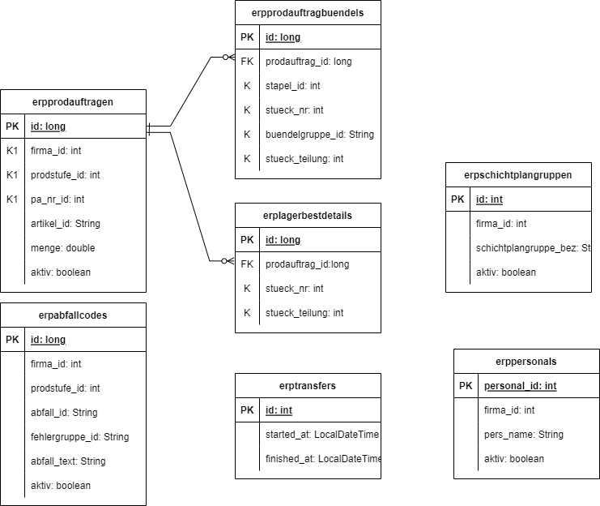
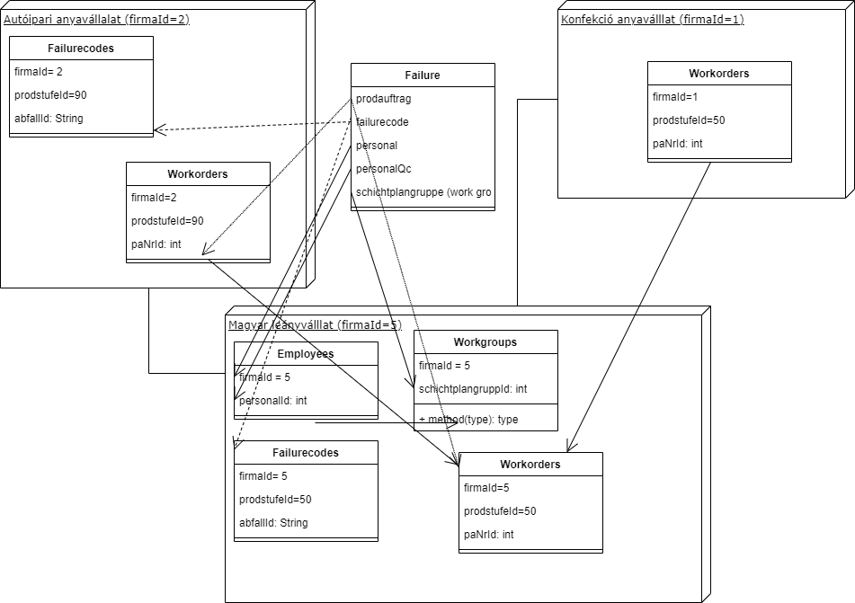
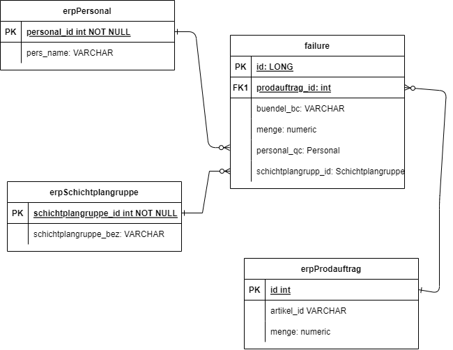

# Gyártási hiba adatgyűjtés

## Leírás

Ezt a feladat azért választottam, mert a munkám során ezt a problémát meg kellet már oldani és szerettem volna a tanfolyamon tanultak használatával újratervezni a megoldást.
A feladat lénaege, hogy egy adott erp rendszerhez egy külső rendszert készítsek, amivel a gyártás során fellépő hibákat lehet nyilvántartani a későbbi szükséges intézkedések támogatására.
Az erp rendszer nem igazán nyújt ehhez használható megoldást. Tableten futó applikáció mellett döntöttünk, amit az itt megvalósítotthoz hasonló backend szolgál ki.

Az adatgyűjtés kiterjed:
- az érintett üzemi megbízás sorszáma és alapadataira (mennyiség, késztermék adatok)
- az érintett késztermék cikkszáma
- a minősítést végző dolgozók azonosítójára
- a hiba besorolására (hibakód)
- a hiba mennyiségére
- a hibát elkövető dolgozó azonosítójára 

A gyártási folyamatban két módon van használva a rendszer:
- autóipari szabványok gyártása (szabás + minősítés): szabás során felmerülő hibák gyűjtése
a szabás befejeztével beviszik a dolgozók a tableten a hibás szabványok mennyiségi adatait hibakódonként, illetve a leszabott jó mennyiséget is, hogy később ezeket elemezni lehessen
- autóipari szabványok gyártása: a minősítés során felmerülő hibák gyűjtése
a minősítés során a minősítők beviszik a talált hibák adatait (hibakód, mennyiség) A hibabevitelnél fontos szempont volt, hogy az adminisztráció a lehető legkevesebb adatbevitellel megoldható legyen, ezért kérés volt,
hogy az adatbeviteli program jelenítse meg az üzemi megbízáshoz tartoző leggyakoribb hibakódokat, és elég legyen csak mennyiséget megadniuk.
-konfekcionálás(ruhaipar): a végellenőrzés során felmerülő hibák gyűjtése
a minősítéssorán a minősítők beviszik atalált hiák kódját és mennyiségét. A hibás termékeket a csoportvezető visszavisz a termelésbe javításra. A csoportvezető ldönti, hogy melyik dolgozó okozta a hibát és ennek megfelelően a tableten megadja a hibához rendelt dolgozó kódját.

Mivel az erp rendszer német és az adatbázis definíció is német, ezért a programban én is az erp rendszerbeli német neveket használom 

Mivel az erp rendszerrel a kapcsolat csak a munkahelyemről hozható létre, ezért az erp adatátvételt csak szimulálja a program előre letárolt adatok alapján. Az erppersonals tábla tartalmát véletlenszerű nevek generálásával állítja elő. 
---

## Felépítés

Három controller (erp/master files kérések, erp/work-orders kérések és a /failures kérések kisolgálására), három service osztály és a megfelelő entitásokhoz tartozó Repository-k ból áll a program.

## Működési elv

Az alkalmazás lekéri és eltárolja az erp rendszerből elérhető törzsadatokat és gyártási megbízások adatait. Az adatok átvételét az adatbázisban az erptransfers táblában tárolja az átvitel indítási és befejezés időpontjával.
Az adatátvitel időközönként automatikusan elvégzi (ha üres az erptransfer tábla, ha az utolsó átvétel befejezése óta már több mint 90 perc eltelt, vagy ha az utolsó adatátvétel kezdete óta már több mint 5 perc eltelt és még nem végzett), hogy kellően friss adatok álljanak rendelkezésre az erp rendszer minimális igénybevételével Az adatátvétel egy tranzakcióban történik, a HTTP kérések kiszolgálása közben az adatokat vagy még a régi, vagy már az új állapot szerint látja a program konzisztensen.
Tehát az adatbázis egy része az erp rendszer adatainak gyorsítótárazására szolgál. Azokban a táblákban (erpprodauftragen, erpabfallcodes, erppersonals, erpschichtplangruppen), amire másik táblák hivatkoznak idegen kulccsal az átvitel előtt az adatokat inaktiválja a program (törölni nem lehet, mert sérülne az adatbázis integritása)
az új adatok tárolásánál ha van már inaktívvá tett előzmény, akkor azt újraaktiválja a program és frissíti az elsődleges kulcs kivételével az adatokat. Azokat a táblákat, amire nincs idegen kulccsal hivatkozás, az átvétel előtt a program törléssel kiüríti.

Az erp rendszer több céget kezel (nálunk két anyacég + a magyar leányvállalat), ezeknek eltérő a firma_id-jük (1,2 és 5). A dolgozók és csoportok a firmaId=5 cégadatbázisban vannak definiálva. Minden nyilvántartott gyártási folyamatot ők végeznek.
az erp rendszer többféle gyártási folyamatot kezel, ezeket a prodstufe_id különbözteti meg. Pl nálunk az 50-es prodstufe_id a konfekcionálást jelenti,
a 90-es pedig az autóipari szabányok szabását és minősítését. Az ezek szerinti bontás/csoportosítás a programban majd minden helyen megjelenik.

### Prodauftrag

A `Prodauftrag` entitás a következő attribútumokkal rendelkezik:

Mivel ez az entitás az erp rendszerből átvett adat, ezért ezen validálást nem végez a program, az használja, amit kap.
* `id`: Long
* automatikusan generált
* `firma_id`: int
* az erp rendszerből jön (> 0)
* `prodstufe_id`: int 
* az erp rendszerből jön (> 0)
* `pa_nr_id`: int
* az erp rendszerből jön (> 0)
* a fenti három attributum az erp rendszerbeli összetett azonosító
* `aktiv`: boolean
* mivel a Prodauftrag entitásokra másik entitások hivatkoznak, ezért sosem törli őket a rendszer, csak az aktiv flag-et hamisra állítja.
* `menge`: double
* erp rendszerből átvett adat
* `artikel_id`: (cikkszám) String
* erp rendszerből átvett adat
* `groesseId`: (méret) String
* erp rendszerből átvett adat
* `farbeId`: (szín) String
* erp rendszerből átvett adat
* `varianteId`: (változat) String
* erp rendszerből átvett adat
* `fertigungszustandId`: (a késztermék gyártottsági foka - milyen gyártási folyamaton esett már át) String
* erp rendszerből átvett adat
* `kennzPartiewechsel`: (alapanyag partie (lot) száma)
* erp rendszerből átvett adat

Végpontok: 

| HTTP metódus | Végpont                                                                                  | Leírás                                                                    |
| ----------- |------------------------------------------------------------------------------------------|----------------------------------------------------------------------------|
| GET         | `"/api/erp/{firmaId}/work-orders"`                                                       | lekérdezi a firmaId-hez tartozó összes entitást                            |
| GET         | `"/api/erp/{firmaId}/work-orders/{prodstufeId}"`                                         | lekérdezi az adott firmaId-hez és prodstufeId-hez tartozó összes entitást  |
| GET         | `"/api/erp/{firmaId}/work-orders/{prodstufeId}"`                                         | lekérdezi az adott entitást                                                |
|GET          | `"/api/erp/{firmaId}/work-orders/{prodstufeId}?stapelId=&buendel1=&buendel2=&buendel3="` | lekérdezi az összes megfelelő entitást                                     |
|GET          | `"/api/erp/{firmaId}/work-orders/{prodstufeId}?StueckNrBc=`                              | lekérdezi az összes megfelelő entitást                                     |

A gyártásban az üzemi megbízást más adatok (vonalkódok) alapján is ki kell keresni. A konfekcionálás során a termékeket egy kötegkísérő azonosítja, arról megállapítható (vonalkódból)
a stapelId, buendel1, buendel2, buendel3, amik alapján egy fenti get metódus segítségével vissza lehet kapni a gyártási megbízás adatait (erpprodauftragbuendls táblában keresve).
Az autóipari gyártásnál a felhasználásra hozzárendelt aapanyagon lévő vonalkódos végkísérővel lehet az azonosítást gyorsítani. A végkísérő vonalkódja StueckNrBc tartalmazza a
stueckNr és stueckTeilung értékét (/ jellel elválasztva, a stueckTeilung opcionális), amivel a fenti GET metódusokkal vissza lehet kapni a gyártási megbízás adatait (erplagerbestdetails táblában keresve).

---
További erp-adatokkal kapcsolatos végpontok:

| HTTP metódus | Végpont                                                    | Leírás                                                                                                  |
|--------------|------------------------------------------------------------|---------------------------------------------------------------------------------------------------------|
| GET          | `"/api/erp"`                                               | lekérdezi az összes erpTransfer Entitást                                                                |
| DELETE       | `"/api/erp"`                                               | törli az összes erpTransfer Entitást ezáltal a következő api/erp GET hívás újra letölti az erp adatokat |
| GET          | `"/api/erp/{firmaId}/master-files/failure-codes"`          | lekérdezi az adott firmaId-hez és prodstufeId-hez tartozó összes hibakód (Abfallcode) entitást       |
| GET          | `"/api/erp/{firmaId}/master-files/employees"`              | lekérdezi az adott firmaId-hez tartozó összes dolgozó (Personal) entitást                            |

minden erp-vel kapcsolatos végpontra küldött GET kérés erp adatátvétel indítását is magával vonja (lásd a működési elv szakasz).
Ez a működés letiltható (alapvetően a teszteléshez) a disableTransferFromErp=true queryparameter használatával.

### Failure 

A `Failure` entitás a következő attribútumokkal rendelkezik:

* `id`: long
* automatikusan generált
* `prodauftrag`: több-egy kapcsoalt a Prodauftrag-hoz
* `buendelBc`: string, a kötegkísérő vonalkódja
* `tsErfassung`: LocalDateTime, a hibarögzítés időpontja
* ha nincs megadva, akkor az aktiális időpontot kell hasznáni.
* `personalQc`: többb-egy kapcsolat Personal-hoz, a minősítő kódja (ha egy szemly minősített)
* kötelező, és létező azonosítónak kell lennie, firmaId=5
* `personalQc2`: többb-egy kapcsolat Personal-hoz, kétszemélyes minősítés esetén a második minősítő kódja
* opcionális, de ha meg van adva akkor létező azonosítónak kell lennie, firmaId=5
* `pruefung2`: boolean annak jelzésére, ha ez újbóli minősítés (bizonyos esetekben kétszer kell minősíteni)
* `abfallcode`: hibakód, többb-egy kapcsolat az Abfallcode-hoz
* kötelező megadni és a prodauftrag szerinti firmaId, prodstufeId szerint létező kódnak kell lennie
* `personal`: többb-egy kapcsolat Personal-hoz, a hibát okozó dolgozó kódj, firmaId=5
* utólag módosítható, mivel csak később deríthető ki!
* opcionális, de ha meg van adva akkor létező azonosítónak kell lennie
* `schichtplangruppe`: több-egy kapcsolat Schichtplangruppe-hoz, gyártó csoport azonosítója
* opcionális, de ha meg van adva akkor létező azonosítónak kell lennie
* `mengeAbfall`: hiba mennyisége
* nincs megkötés
* `stueckNr`: int
* opcionális, ha a gyártási megbízást a végkísérővel azonosították, akkor lehet beküldeni, azt jelzi, hogy szabászaton talált hibáról van szó.
* `stueckTeilung`: int
* opcionális, csak ha van stueckNr, akkor lehet értéke
* `menge_gutz`: double, jó mennyiség a szabás során
* `zuschnittFertig`: boolean, az igaz azt jelenti, hogy kész a szabás
* `mengeGutp`: double, jó mennyiség a minősítés során
* `pruefungFertig`: boolean, az igaz azt jelenti, hogy kész a minősítés

A `Prodauftrag` és a `failures` entitások között egyirányú, n-1 kapcsolat van.

Végpontok:

| HTTP metódus | Végpont                  | Leírás                                                                                                                                                                    |
|--------------|--------------------------|---------------------------------------------------------------------------------------------------------------------------------------------------------------------------|
| 1. GET       | `"api/failures-v2"`      | lekérdezi az összes entitást                                                                                                                                              |
| 2. GET       | `"api/failures-v2?"`     | queryString (buendelBc=) alapján lekérdezi az entitásokat (egy adott kötegen "buendelBc" berögzített hibák a dolgozókód bevitelhez)                                       |
| 3. GET       | `"api/failures-v2?"`     | queryString (personalId=,hours=) alapján lekérdezi az entitásokat (egy adott meós által az utolsó hours órában rögzített hibák pa-nként összesített dbszámát adja vissza) |
| 4. GET       | `"api/failures-v2/{id}"` | lekérdez egy entitást `id` alapján                                                                                                                                        |
| 5. POST      | `"api/failures-v2"`      | létrehoz egy új entitást                                                                                                                                                  |
| 6. PUT       | `"api/failures-v2/{id}"` | módosítja egy entitást personal attributumát `id` alapján                                                                                                                 |
| 7. GET       | `"api/failures-v2/top?"` | queryString (firmaId=&prodstufeId=&PaNrID=&abfallId&withStueckNr&count) alapján lekérdezi a megadott gyártási megbízásnál éppen aktuális legtöbbször előforduló hibákat   |

A 3. és 7. lekérdezés hibakódonként összesített dbszámot ad vissza (a 3. pa szám szerinti bontásban)! Hibákat nem szabad törölni, ellenkező előjelő adatfelvitellel sztornózni szabad csak!

---

## Technológiai részletek

Háromrétegű alkalmazás (repository, service és controller rétegek) JPA Repository használatával, mariadb adatbázissal. Swagger UI felülettel, docker konténerizációs lehetőséggel.
Az erp elérés mentett adatokból történő betöltéssel van helyettesítve.

---
